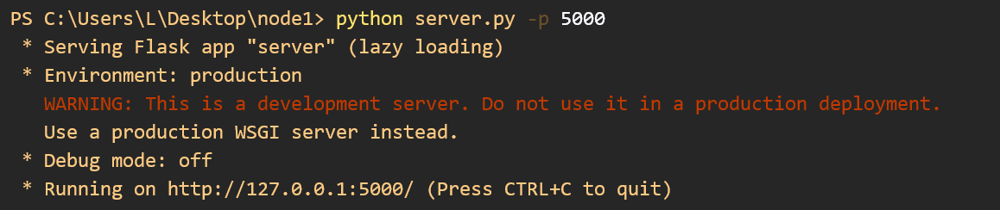
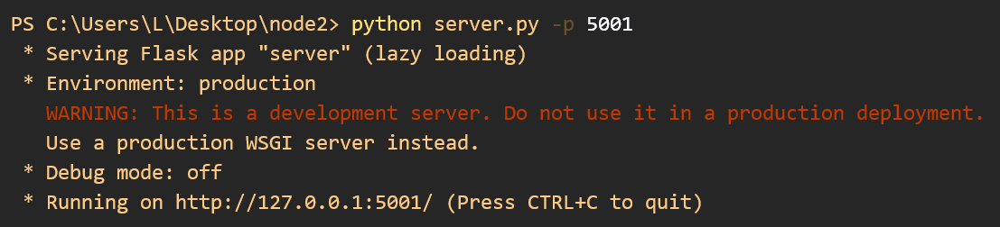
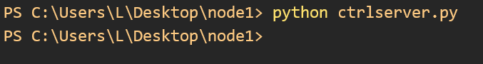
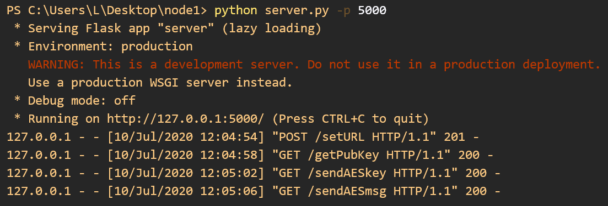
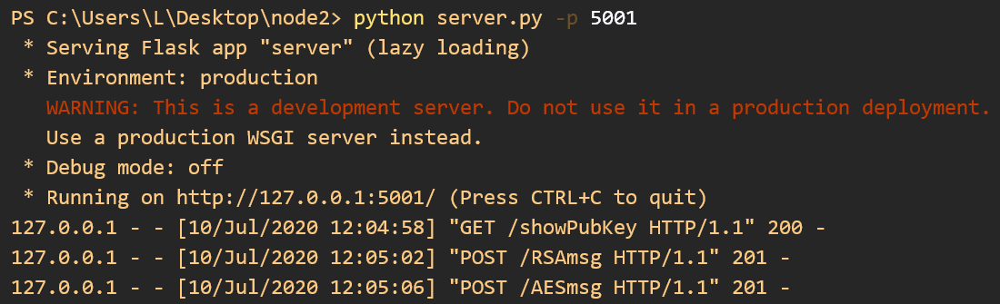
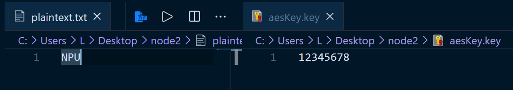

# RSA与AES混合加密

## 介绍

这个项目实现的功能是在两台主机之间，通过RSA进行AES密钥分发，并使用AES通过网络进行数据加密传输。

项目全部使用Python编写，分为三个模块。

1. RSA算法。1024 bits的密钥从网上找个生成器生成的，通过`Crpypto.PublicKey`的RSA模块读取公钥、私钥的具体数值。
2. AES算法。实现使用了[Bo Zhu](https://about.bozhu.me/)的[开源库](https://github.com/bozhu/AES-Python)。
3. 网络通信。用`flask`实现。

## 运行

经测试在`Python 3.7.4`下成功运行。

需要的运行库：

- `Crypto`仅用于提取公钥`(n, e)`。如果遇到问题，先安装`pycryptodome`库，在`Python\Lib\site-packages`下把`crypto`改为`Crypto`即可。

- `requests`
- `flask`

在5000端口启动服务器。作为测试，需要在两个端口启动服务器互相通信。

```powershell
python server.py -p 5000
```

在ctrlserver.py中配置好两台服务器的IP地址和端口号、要分发的密钥和要传输的明文。

```powershell
python ctrlserver.py
```

## 文件组成与运行过程

### 文件组成

- `pri.key` 存放服务器私钥
- `pub.key` 存放服务器公钥
- `aesKey.key` 存放AES加解密密钥
- `plaintext.txt` 存放通过AES传输的明文，或AES解密得到的明文
- `readRSAkey.py` 返回服务器的公钥私钥值(n, e, d)
- `rsa.py` 实现RSA算法
- `aes.py` 实现AES算法
- `server.py` 实现Flask服务器相关功能
- `ctrlserver.py` 控制服务器自动完成密钥分发与加密传输

### 运行过程

1. 为服务器设置通信方的IP地址及端口号。
2. 获取对方服务器的公钥。
3. 将要分发的AES密钥写入aesKey.key，要通过AES加密传输的明文写入plaintext.txt。
4. 通过RSA进行密钥分发。接收方将AES密钥保存在aesKey.key中。
5. 通过AES进行加密传输。接收方将解密的明文保存在plaintext.txt中。

## 模块构成

### RSA

RSA的加解密函数。使用快速模幂算法进行计算。

```python
def RSA_Encryption(plainText:str, n:int, e:int) -> int
```

```python
def RSA_Decryption(cipherTextInt:int, d:int, n:int) -> str 
```

### AES

在`AES`类中进行加解密等操作。

通过传入的`master_key`进行轮密钥生成。

```python
def change_key(self, master_key)
```

加解密操作。

```python
def encrypt(self, plaintext)
```

```python
def decrypt(self, ciphertext)
```

### Flask服务器

数据主要以`json`格式进行传输。

1. 向请求方返回自己的公钥。

```python
@app.route('/showPubKey', methods=['GET'])
```

2. 设置通信方的IP地址及端口号。

```python
@app.route('/setURL', methods=['POST'])
```

3. 请求获取通信方的公钥。

```python
@app.route('/getPubKey', methods=['GET'])
```

4. 接收通过RSA加密的AES会话密钥，并解密存储在aesKey.key中。

```python
@app.route('/RSAmsg',  methods=['POST'])
```

5. 接收通过AES加密的信息，并解密存储在plaintext.txt中。

```python
@app.route('/AESmsg', methods=['POST'])
```

6. 发送通过RSA加密的AES会话密钥。

```python
@app.route('/sendAESkey', methods=['GET'])
```

7. 发送通过AES加密的信息

```python
@app.route('/sendAESmsg', methods=['GET'])
```

### ctrlserver.py

`ctrlserver.py`提供了一些函数，通过与服务器进行通信，设置服务器的通信方，以及控制服务器执行所需操作。可以通过修改`ctrlserver.py`的内容，或者编写新的脚本调用`ctrlserver.py`的函数来控制服务器。

1. 修改要传输的AES会话密钥。

```python
def changeAESkey(newKey:str)
```

2. 设置服务器的通信方。

```python
def setURL(newURL:str)
```

3. 控制服务器，请求得到通信方的公钥。

```python
def getPubKey()
```

4. 修改要传输的明文。

```python
def changePlainText(plainText:str)
```

5. 控制服务器传输RSA加密的AES密钥，进行密钥分发。

```python
def shareKey()
```

6. 控制服务器发送AES加密的信息

```python
def sndMsg()
```

## 运行截图

配置`ctrlserver.py`。


启动两台服务器。





执行运行在`5000`端口服务器的控制脚本。







此时`5001`端口服务器的aesKey.key和plaintext.txt已经写入了AES密钥和解密后的明文。

