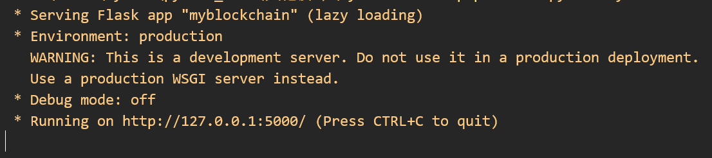
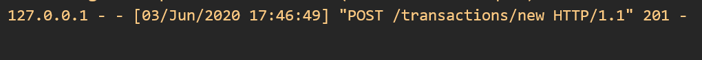
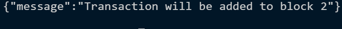
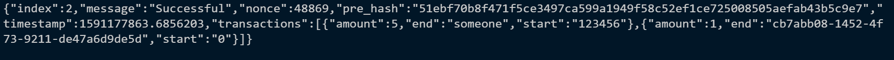
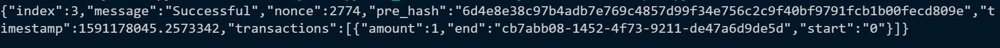
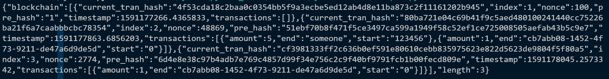
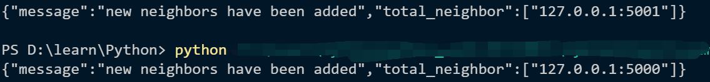
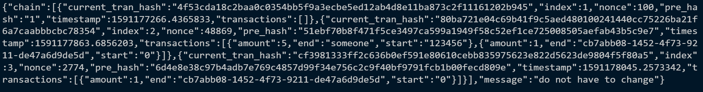
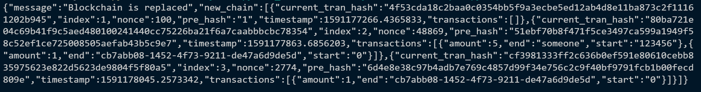

# 一个简单的区块链演示程序

本演示程序包含了区块链的链式结构组成方式与冲突的解决。

## 安装与运行

本程序需要额外安装的python库

- Flask

- pipenv

```python
pip install pipenv
```

在pipenv运行环境中安装flask和requests

```python
pipenv install flask
pipenv install requests
```

运行程序

```powershell
pipenv run python myblockchain.py -p 5000
```

## 程序说明

### 实现的功能

1. 一个个人区块链服务器
2. 添加交易记录
3. 创建区块
4. 提供工作量证明
5. 查看当前区块链上的所有区块信息
6. 解决冲突

### 交易记录的结构

一笔交易记录包含三项

- 交易发起者(start)
- 交易接收者(end)
- 交易量(amount)

### 区块的结构

一个区块包含下列内容

- 区块索引值(index)
- 上一个区块的哈希值(pre_hash)
- 交易记录(transactions)
- 当前区块交易记录的哈希值(current_tran_hash)
- 时间戳(timestamp)
- 提供工作量证明的数字(nonce)

### 工作量证明的难题

构造了一个问题：找到这样一个nonce，将当前区块链最后一个区块的nonce与nonce相加，拼接到最后一个区块的哈希值前，再一次取哈希，得到前4个字符都是'0'的哈希值。

### 在Flask服务器上调用功能

1. /showchain

    访问该页面，返回json格式的数据。包含区块链中所有区块的信息，以及区块链长度。

2.  /transactions/new

    访问该页面，并POST一条json格式的交易记录。这笔交易记录将会被保存在服务器上，下一个区块被挖出时，交易将会添加到下一个区块的交易记录中(transactions)。

3.  /mine

    访问该页面，将在服务器上执行工作量证明程序，新建一笔挖矿奖励交易，并将当前系统内累积的交易记录存入新建的区块中，返回新区块的信息。

4. /neighbor/register

    向该页面POST可信任的其他区块链节点，与这些节点进行区块链的同步。

5. /neighbor/solve

    访问该页面，进行区块链的冲突处理。做法是将最长的链作为主链，替换掉原本的链。

## 运行示例及图片

执行`pipenv run python myblockchain.py -p 5000`，在本地的5000端口启动区块链服务器。



### 添加交易

```python
def add_transactions():
	url = "http://localhost:5000/transactions/new"
	data = {
		"start": "123456",
		"end": "someone",
		"amount": 5
	}
	data = json.dumps(data)
	return requests.post(url=url, data=data)
```

用上面的函数添加一笔交易。





上面的图片分别是服务器收到的消息，以及客户端收到的返回信息。

### 挖矿及工作量证明

```python
def mine():
	url = "http://localhost:5000/mine"
	return requests.get(url)
```

用上面的函数进行挖矿。



经过验证后，服务器返回的消息。注意，挖矿奖励的交易将会在下一个被挖出的区块之中。



再次挖矿，交易显示的就是上一笔的奖励交易。其中收方是挖矿者的uuid。

### 显示当前的区块链

```python
def showchain():
	url1 = "http://localhost:5000/showchain"
	return requests.get(url1)
```



以json格式返回的区块链，包含每个区块的信息。

### 添加邻居节点

`pipenv run python myblockchain.py -p 5001`启动另一个区块链服务器。

```python
def addnei():
	nei1 = "http://127.0.0.1:5000"
	nei2 = "http://127.0.0.1:5001"
	url1 = "http://127.0.0.1:5000/neighbor/register"
	url2 = "http://127.0.0.1:5001/neighbor/register"
	data = {
		"neighbor": [nei2],
	}
	data = json.dumps(data)
	return requests.post(url1, data=data)
```

上面是向5000端口运行的服务器添加5001节点的函数。通过这种方式双方分别添加对方为可信任邻居节点。



### 解决冲突

此时5000端口的服务器有两个区块，而5001端口的服务器没有区块。

```python
def solve():
	url1 = "http://127.0.0.1:5000/neighbor/solve"
	url2 = "http://127.0.0.1:5001/neighbor/solve"
	return requests.get(url1)
```

解决冲突的方式为：如果有邻居节点的区块链更长，则用邻居节点的区块替换自己的区块。



使5000端口的服务器解决冲突，返回message为do not have to change。



使5001端口的服务器解决冲突，返回message为Blockchain is replaced，且返回更新后的区块链。

